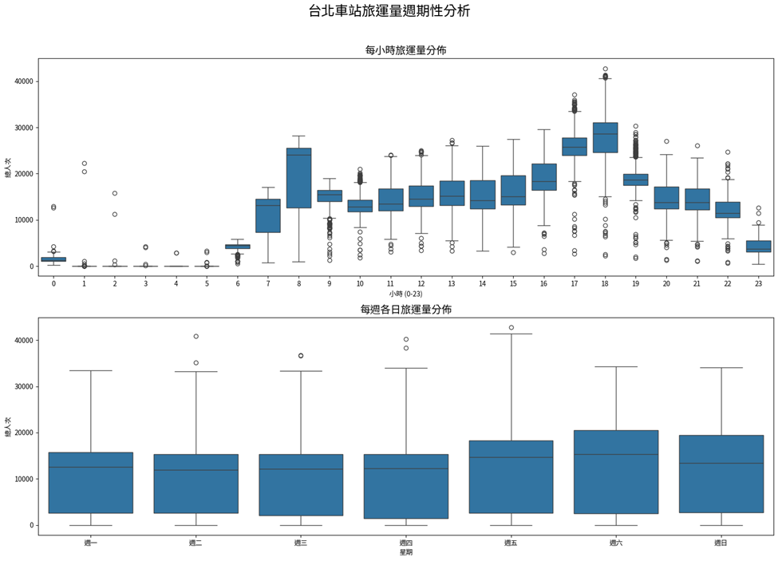
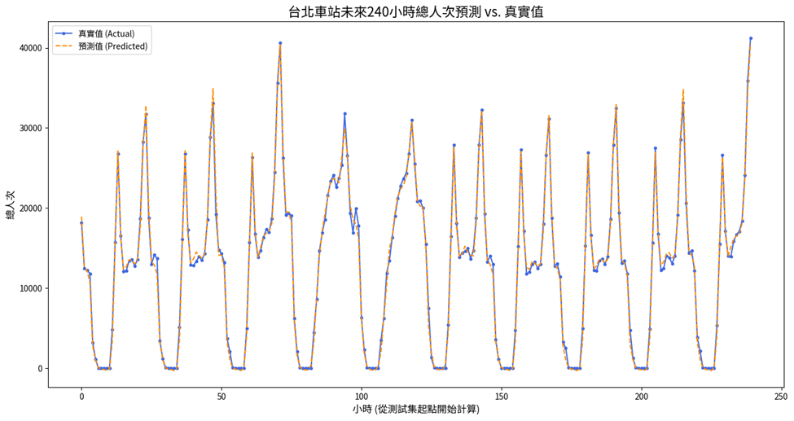

# MRT Traffic Analysis - Deep Learning Framework for Taipei Metro Time Series Data

A comprehensive deep learning framework for analyzing and predicting passenger traffic patterns in Taipei Metro (MRT) system using time series data.

## 🚇 Project Overview

This project applies deep learning techniques to analyze Taipei Metro's Origin-Destination (OD) passenger flow data, focusing on traffic pattern recognition and prediction. The framework processes massive datasets (800+ million records) and implements LSTM neural networks for time series forecasting.

## 🎯 Objectives

- **Data Processing**: Automatically download and process monthly OD flow data from Taipei Open Data Platform
- **Pattern Analysis**: Identify temporal patterns in metro passenger traffic through exploratory data analysis
- **Predictive Modeling**: Build LSTM models to forecast hourly passenger volumes
- **Visualization**: Create comprehensive visualizations for traffic pattern insights

## 🔧 Features

- Automated data acquisition from Taipei Open Data Platform
- Large-scale data processing and aggregation (800M+ records → station-level hourly data)
- Time series feature engineering with temporal characteristics
- LSTM neural network implementation for traffic prediction
- Comprehensive EDA with Chinese font support for visualizations
- Memory-optimized data processing for handling massive datasets

## 📊 Data Source

- **Dataset**: Taipei Metro Daily OD Flow Statistics by Hour and Station
- **Source**: [Taipei Open Data Platform](https://data.taipei/dataset/detail?id=63f31c7e-7fc3-418b-bd82-b95158755b4d)
- **Period**: January 2023 - April 2025
- **Volume**: 800+ million individual trip records
- **Target Station**: Taipei Main Station (台北車站)

## 🛠️ Installation

### Prerequisites
- Python 3.8+
- pip package manager

### Setup
1. Clone the repository:
```bash
git clone https://github.com/Rui0828/MRT_Traffic_Analysis.git
cd MRT_Traffic_Analysis
```

2. Install required packages:
```bash
pip install -r requirements.txt
```

3. Create necessary directories:
```bash
mkdir -p data/raw data/processed
```

## 📁 Project Structure

```
MRT_Traffic_Analysis/
├── README.md
├── requirements.txt
├── data/
│   ├── raw/                    # Raw CSV files from Taipei Open Data
│   └── processed/              # Processed and aggregated data
├── notebooks/
│   ├── 01-Data_Acquisition_and_Processing.ipynb
│   └── 02-EDA_and_Feature_Engineering.ipynb
└── src/
    ├── data_loader.py          # Data acquisition utilities
    └── data_processor.py       # Data processing functions
```

## 🚀 Usage

### Step 1: Data Acquisition and Processing
Run the first notebook to download and process raw data:
```bash
jupyter notebook notebooks/01-Data_Acquisition_and_Processing.ipynb
```

This notebook will:
- Download monthly CSV files from Taipei Open Data Platform
- Merge 800+ million records into a single DataFrame
- Aggregate data to hourly passenger counts for target station
- Save processed data as pickle file for analysis

### Step 2: Exploratory Data Analysis and Modeling
Run the second notebook for analysis and modeling:
```bash
jupyter notebook notebooks/02-EDA_and_Feature_Engineering.ipynb
```

This notebook will:
- Load processed time series data
- Perform comprehensive EDA with visualizations
- Engineer temporal features from timestamps
- Build and train LSTM models for traffic prediction
- Evaluate model performance and visualize results

## 🧠 Methodology

### Data Processing Pipeline
1. **Acquisition**: Automated download of monthly OD flow CSV files
2. **Aggregation**: Summarize origin-destination pairs to station-level hourly totals
3. **Time Alignment**: Ensure continuous hourly time series with gap filling
4. **Feature Engineering**: Extract temporal features (hour, day of week, seasonality)

### Data Visualization
This research primarily employs **Box Plots** and **Heatmaps** for visualization to explore periodic patterns in the aggregated time series data:


- **Box Plot Analysis**: Used to examine the distribution of passenger volumes across different time dimensions (hourly patterns and daily patterns throughout the week)
- **Heatmap Visualization**: Applied to reveal the relationship between day of week and hour of day, showing average passenger counts as a color-coded matrix
- **Purpose**: These visualization techniques effectively capture and display cyclical patterns, peak hours, and seasonal variations in metro ridership data

### Machine Learning Approach
- **Model**: LSTM (Long Short-Term Memory) Neural Network
- **Architecture**: Multi-layer LSTM with dropout regularization
- **Input**: 24-hour historical data with temporal features
- **Output**: Next-hour passenger volume prediction
- **Training**: 80/20 train-test split with early stopping

### Key Features
- **Temporal Features**: Hour, day of week, month, quarter, weekend indicator
- **Scaling**: MinMax normalization for neural network training
- **Sequence Generation**: Sliding window approach for supervised learning
- **Evaluation**: MAE, RMSE metrics with visualization comparisons

## 📈 Results

### Model Performance
The LSTM model achieves the following performance on the test dataset:




| Metric | Value | Interpretation |
|--------|-------|----------------|
| **Mean Absolute Error (MAE)** | 625.42 | The model's hourly passenger count predictions deviate from actual values by an average of ~625 passengers |
| **Root Mean Square Error (RMSE)** | 1023.55 | This metric is more sensitive to larger errors; the higher value compared to MAE indicates some predictions have significant deviations |

### Key Insights
- Clear daily and weekly passenger flow patterns identified
- Peak hours successfully captured for operational planning
- Distinct weekend vs. weekday traffic differences observed  
- Seasonal variations in metro usage patterns documented
- **Model Accuracy**: The MAE of 625 passengers represents reasonable accuracy for hourly predictions at one of Taiwan's busiest transit stations
- **Practical Application**: The model provides valuable forecasting capability for capacity planning and resource allocation

### Visual Validation
The model demonstrates strong pattern recognition with side-by-side comparison visualizations showing:
- Accurate capture of daily peak and off-peak patterns
- Successful prediction of weekend traffic variations
- Good generalization to unseen test data periods

## 📋 Requirements

See `requirements.txt` for complete dependencies:
- pandas==2.3.0 - Data manipulation and analysis
- tqdm==4.67.1 - Progress bars for data processing
- seaborn==0.13.2 - Statistical data visualization
- matplotlib==3.10.3 - Plotting library with Chinese font support
- scikit-learn==1.7.0 - Machine learning utilities
- tensorflow==2.19.0 - Deep learning framework for LSTM models


## 🙏 Acknowledgments

- Taipei City Government for providing open data access
- Taipei Metro Corporation for comprehensive ridership data
- Course instructors and peers for guidance and feedback

---

**Note**: This project handles large datasets (800M+ records) and requires sufficient computational resources for processing and model training.